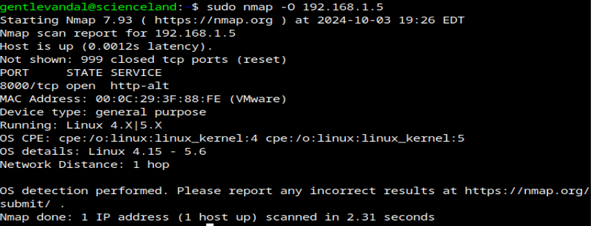
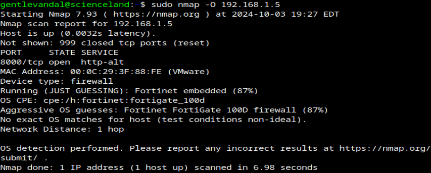

# netfilter-evade-os-detection
Netfilter Kernel module to hide your OS from nmap OS detection

Only tested using Linux kernel version 6.1.0-25. 

More tests welcome! It crashes machine right now after getting the traffic. ([at least that is what I think](https://twitter.com/GriefOfNight/status/1841986800513855690))

Before and after loading the module (I tried to fake Windows but oh well...):

 
